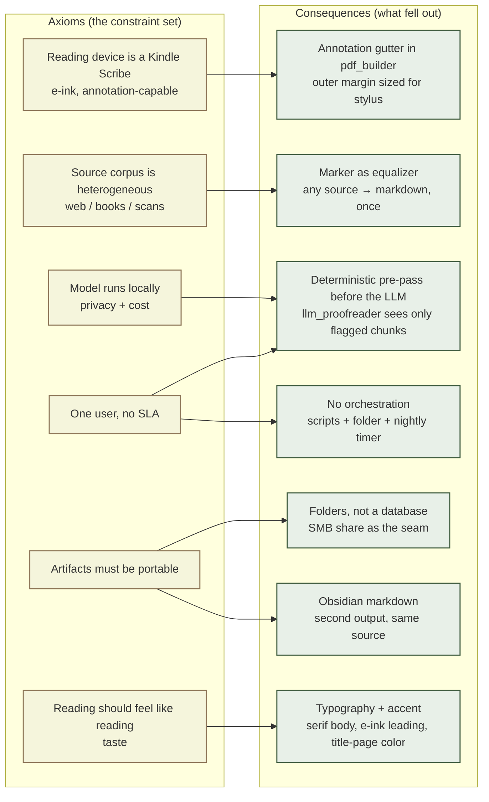

# A reading pipeline I didn't design — I derived

I read on a Kindle Scribe. I save things to read on Karakeep. The pipeline between the two started as three scripts I wrote one weekend, and over a few months grew into something more interesting in retrospect than it was to build. Interesting because I didn't design it. I derived it. Each piece earns its place from a specific property of the constraint set, and what's there is exactly what survived the question *do I really need this?*

There is no architecture document. There is a list of things I refused to give up.

## The constraints

These are the axioms. Everything below is a consequence.

1. **The reading device is a Kindle Scribe.** 10.3" e-ink, slow refresh, paper-like contrast, no backlight. Critically, it accepts handwritten annotation via stylus, which is most of why I bought it. The output of the pipeline has to be a PDF sized for that device, with margins generous enough to write in.
2. **The source corpus is heterogeneous.** Web essays I bookmark on impulse, scanned books, OCR'd academic papers, the occasional whitepaper. There is no single source format I can standardize on upstream.
3. **The model runs locally.** Ollama against `qwen3:8b` on a laptop. The constraint underneath is mostly privacy — I don't want my reading list sitting in someone else's inference logs — and partly that for personal reading there's no cost-justifiable case for cloud inference. Local model is the consequence.
4. **One user, no SLA.** The cost of a bad run is that I reread a paragraph. There is no operations team. There is no on-call.
5. **The artifacts should be portable.** When I finish reading something, I want the markdown in my Obsidian vault. I don't want a proprietary format I'll regret in three years.
6. **The reading should feel like reading.** Serif body, generous leading, an accent color on the title page. Pleasure of use is a real constraint — the pipeline outputs a document I read for an hour at a stretch, not a printout.

That's the constraint set. Some of it is post-hoc — the Scribe was bought before the pipeline existed; the local-model preference is partly principle and partly pragmatism — but those are the things I refused to give up once I started building, which is what an axiom set in practice usually is.

## Karakeep as the inbox

The bookmarking layer is [Karakeep](https://karakeep.app), self-hosted on my home server. It runs as a Docker stack: the app itself, a Meilisearch instance for full-text search, and an alpine-chrome sidecar that does headless browser archiving. I save articles to it from my phone, my laptop, and the share sheet on whatever device happens to be in my hand. One tap, one save.

What I get for free, per bookmark:

- Reader-mode HTML (clean text, no chrome)
- Full-page archive (the original page snapshot)
- Screenshot
- Banner image
- The original PDF, if the bookmark was a PDF asset
- Tags, metadata, summaries

This is more than I need from a read-it-later app. It is also exactly what I need from a *source layer for a downstream pipeline* — and the first design choice was not writing that source layer myself. Karakeep had already solved it.

I could have skipped Karakeep and pointed scripts at any bookmarking API — Pocket, Instapaper, Pinboard, Wallabag, whatever. I didn't, and the reason is mundane and load-bearing: I want the bookmarks to outlive the pipeline. If I rebuild the Kindle pipeline next year, the bookmarks should still be there, untouched, in their own system. Coupling the inbox to the conversion machinery would have made both more brittle.

## The export is the contract

Karakeep has an HTTP API. The pipeline does not use it directly.

Instead, a nightly systemd timer on the server (`karakeep-export.timer`, fires at 05:00 UTC with up to ten minutes of randomized delay) runs a oneshot service that calls a small Python script (`karakeep-export.py`). The script paginates the Karakeep API and writes every bookmark to a folder on a Samba share that the rest of my LAN already mounts:

```
/srv/samba/shared/karakeep-export/
  <tag-name>/
    <safe-title>_<short-id>/
      metadata.json
      content.html
      screenshot.png
      banner.jpg
      archive.html
      original.pdf
      original.<ext>
```

The header comment in the script reads: *no conversion — raw assets are copied as-is so a downstream AI agent can do its own multimodal processing*. That comment is the design.

Two non-obvious decisions here.

**The Samba share is the seam between halves of the system.** The bookmarking server (Linux, runs Docker, sits in a closet) and the conversion machine (Windows laptop, runs Marker and Ollama) are completely different worlds. They don't share a runtime, a language, a deploy story, or a network namespace. What they do share is a folder. Either side can be replaced without touching the other. If I move the conversion off Windows tomorrow, the new machine just mounts the same share and reads from the same layout. If I migrate from Karakeep to something else, the new exporter writes the same folder structure and nothing downstream notices.

A folder on a network share is a famously unfashionable interface. It's also one of the most stable interfaces I've ever shipped against.

**Multi-tag bookmarks are hardlinked, not copied.** A bookmark tagged both `essays` and `to-read` appears under both folders, but only one copy lives on disk. I get the natural directory layout without doubling storage. This was a small filesystem trick, and it's the kind of decision that's only available if you've decided your interface is a filesystem rather than a database in the first place.

State lives in `/var/lib/karakeep-export/state.json`; reruns are idempotent and incremental. The script is about 200 lines.

## Marker as the equalizer

The conversion side of the pipeline lives on the laptop. The first step it runs is [Marker](https://github.com/datalab-to/marker), a high-quality PDF-to-markdown OCR system.

Marker is the heaviest single component in the pipeline by orders of magnitude. It takes a couple of minutes to convert a book. It is also doing the most useful work in the system: every input — a scanned book, a clean PDF, an HTML-rendered web article — comes out the other side as the same shape. Clean markdown, extracted images, structural headings.

This is the second contract in the pipeline. The first was *every bookmark is a folder of assets*. The second is *every input downstream of Marker is markdown*. From here on, none of my code knows or cares whether the source was a 1960s scanned philosophy book or a Substack essay from last week. They are the same shape. The pipeline gets shorter from here.

Honest about the tradeoff: Marker is slow and not free to run — it pulls in surya-ocr, ML models, GPU expectations. For a corpus my size (a few books a month, a handful of essays a week) it's overkill. I keep it because the alternative is N source-specific normalizers, and that's a worse codebase than one slow normalizer.

## The deterministic pre-pass before the LLM

I covered this at length in the agent-harness essay, so I'll be brief. `clean_markdown.py` is a regex pass. It finds joined words from OCR (`thequickbrown`), duplicate headings, malformed LaTeX, empty figure placeholders, and a small catalog of other Marker-produced glitches. It is the cheapest, fastest, most reliable component in the pipeline.

The LLM proofreader (`llm_proofreader.py`, `qwen3:8b` on Ollama, with a verifier subagent reviewing each proposed fix) only sees chunks where the deterministic pass surfaced an issue. Most pages never get sent to the model at all. The pre-pass is what makes the rest of the system tolerable on a laptop — Ollama is fine, but it is not fast, and "call the LLM on every page" is a runtime budget I don't have.

The LLM is the most expensive, slowest, and least reliable component in the chain. The pipeline is built to spend as little of it as possible. That's the rule, and it is *the* rule that distinguishes this system from a more naive one.

## pdf_builder, targeted at the Scribe

`pdf_builder.py` is the smallest interesting file in the pipeline. It uses [reportlab](https://www.reportlab.com/) to generate the final PDF: title pages, chapter breaks, typography, blockquote treatment, figure placeholders for images that the OCR pass dropped or that Marker couldn't extract.

What's specific to the Scribe:

- Margins sized for the annotation gutter, not for centered prose. The outer edge is wider than feels normal because that's where the stylus goes. (The page itself stays Letter-sized — the device handles the scaling, and Letter prints fine on the rare occasion I want a hardcopy.)
- Typography tuned for e-ink: serif body, generous leading, no thin strokes that smear on slow refresh.
- A muted accent color per book, configured in `books.json`. The Scribe is grayscale, but the same PDF gets used on iPads sometimes, and the accent gives the title pages a small amount of personality without going decorative.

The PDF is not a beautiful publishing artifact. It is a reading instrument for one specific device. The same code would produce a worse-than-average PDF for an iPad, and a much worse-than-average one for a desktop. That is a feature; the budget for fitness-to-purpose was spent on the device that is in my hand 90% of the time.

## Obsidian export as the second output

The pipeline also writes the same content as Obsidian-flavored markdown. Same source, different rendering: YAML frontmatter, wiki-style links where appropriate, image references mapped into the vault's attachments folder.

The PDF is what I read. The markdown is what I keep. After I finish a book, the Obsidian copy is searchable in my vault, cross-linkable to anything else I've written, and survives the Scribe being lost or replaced. One pipeline run produces two outputs from one source of truth.

This is the smallest piece of polish in the system, and it pays for itself every time I want to grep for a half-remembered passage from something I read six months ago.

## What isn't in the system

The shape of the system is at least as much about what it doesn't include as what it does.

- **No cloud LLM.** Local Ollama, by choice. The constraint is mild but real: I don't want to ship my reading list to an inference provider. Local also means there's no cost signal and no quota, which is the part of [the agent-harness essay](/essays/agent-harness-commitment-curve.html) where my own reasoning broke down. I still don't have a good answer for that one, but for this pipeline the choice is straightforward.
- **No vector database.** No semantic retrieval over the corpus. Karakeep already provides Meilisearch over my bookmarks; Obsidian provides search over my notes. Adding a third retrieval layer would be earned by a use case I don't have yet.
- **No proofread artifact retained.** The deterministic and LLM-driven fixes are committed in-place; the pre-fix markdown is gone. I'm about 70% sure this is correct; I'd revisit the day I want to A/B different proofreading regimes. Right now it would be ceremony.

Each of these is a candidate component I declined to build. The pipeline is small partly because of what's in it, and partly because of what isn't.

## The shape that fell out

The chain end-to-end:

Phone → Karakeep → systemd timer → SMB share → Marker OCR → clean_markdown.py → llm_proofreader.py (sometimes) → pdf_builder.py → Kindle Scribe. Marker also branches off to write the Obsidian markdown copy.

The system gets *simpler* as it moves toward the reader. Karakeep is a full application with a UI, search, browser archiving, tagging, summarization. The export is one Python file. Marker is a heavy ML system. Everything after Marker is small scripts. The PDF builder is the smallest piece, and it is the one closest to the user.

The most expensive thing in the chain — the LLM — does the least. It is fenced in by deterministic gating in front and a verifier behind, and it is only called when a regex pass has decided the call is worth making.

This shape is not what I would have drawn on a whiteboard if you'd asked me to design a reading pipeline. It is what fell out of the constraints, taken honestly:

- Reading device is e-ink, annotation-capable → output is PDF with annotation margins.
- Sources are heterogeneous → normalize early and once (Marker).
- Local model only → call it last, narrowly, with deterministic gating in front.
- One user, no SLA → no orchestration, no daemons, no scheduling beyond a nightly timer. Scripts and a folder.
- Artifacts should be portable → folders of files, not a database, not a proprietary format.
- Reading should feel like reading → typography, leading, an accent color on the title page.

Six sentences. The pipeline is the longhand version of those six sentences.

The same idea, drawn:



Most of the arrows are 1:1 — one constraint, one consequence, the cleanest case of derivation. Two are 1:many: portable artifacts forces both *folders, not a database* and *Obsidian as a second output*. One is many:1: the deterministic pre-pass exists because of the local-model constraint *and* the no-SLA constraint together. That's the place I had to think hardest about, and it's also the design choice I'm most confident is right — when two axioms agree on a structural move, the move is overdetermined.

## The lens

The agent-harness essay made the abstract version of this claim — that the interesting design in any system is in the axioms, not in the components, and that components are earned by a specific property of the constraint set or they aren't earned at all. This pipeline is the concrete version.

When I take the constraints seriously and refuse to import any structure that isn't paid for by them, the system that emerges is small. It is also legible. I can read every file in it. I can change any one component without touching the others. The seams between components are mundane — folders, markdown, PDFs — and that's the point. Mundane interfaces are the ones that survive.

That isn't elegance for its own sake. It's a property of *deriving* a pipeline rather than *designing* one. Design says: here is the system I want, let me build it. Derivation says: here is what I have to work with, what's the smallest thing that survives?

This pipeline is a derivation. The systems I trust most in my life are the ones I built like this; the ones I trust least are the ones I designed top-down and then patched until they more or less worked. That's induction from a small set, not proof of method — but it's the heuristic I keep coming back to.

The Scribe is in my hand right now. The pipeline ran at 05:00 UTC. There are seven new things to read in `to-read/`. None of that required me to think about it. That's the property the constraints earned.

---

*Chris Moore. Companion piece to [Agent harnesses are a commitment curve, not a checklist](/essays/agent-harness-commitment-curve.html).*
